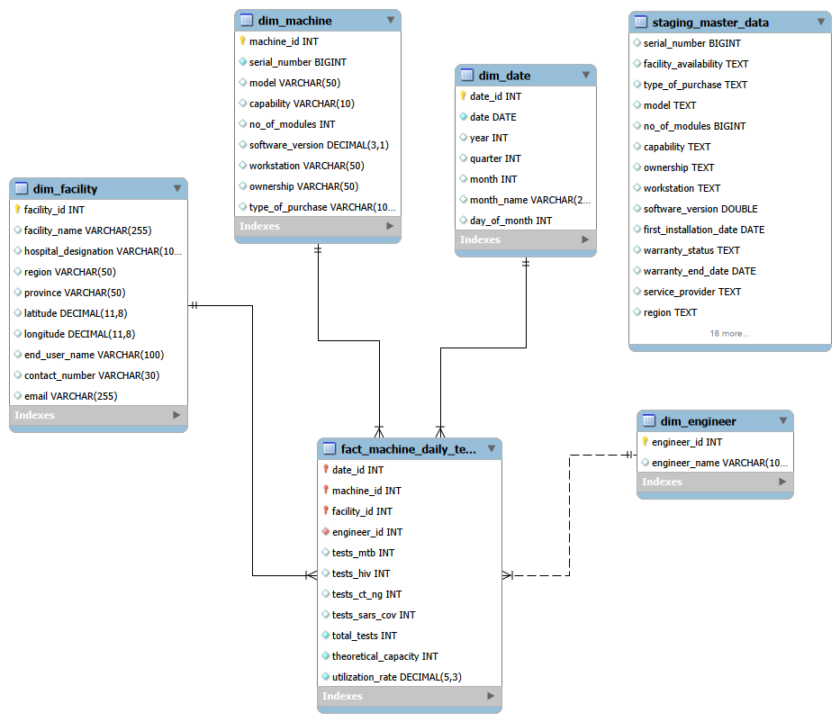
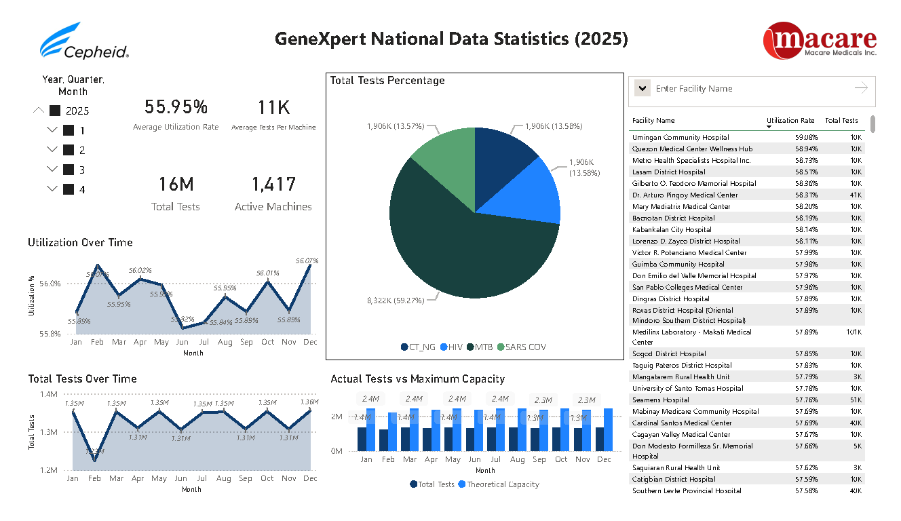

# GeneXpert Analytics Pipeline

## Project Overview

This project implements an end-to-end analytics pipeline for analyzing national GeneXpert diagnostic testing operations. The objective of the project is to assess testing volume, machine utilization, and capacity efficiency across facilities over time.

Raw CSV data is processed using Python-based ETL scripts and loaded into a MySQL data warehouse designed with a star schema. The warehouse serves as the single source of truth for analytical reporting.

The curated data model is then integrated into Power BI, where business metrics are calculated using DAX measures and presented through an interactive dashboard to support operational and planning insights.

## Architecture

The project follows a layered analytics architecture, separating data ingestion, transformation, storage, and visualization.

Raw CSV files are ingested using Python ETL scripts. Source data is first loaded into a staging table for cleaning, normalization, and validation. Curated dimension and fact tables are then populated in a MySQL data warehouse modeled using a star schema.

Power BI connects directly to the MySQL warehouse and serves as the analytics layer. Data transformations in Power BI are kept minimal, with all business metrics implemented as DAX measures to ensure consistency across reports.

## Data Model

The data warehouse is modeled using a star schema optimized for analytical queries and business intelligence reporting.

The central fact table, `fact_machine_daily_tests`, captures daily diagnostic testing activity at a grain of one machine per facility per day. It contains measures related to test volumes, theoretical capacity, and machine utilization.

The fact table is surrounded by conformed dimension tables:
- `dim_date` provides calendar attributes for time-based analysis.
- `dim_machine` stores static and slowly changing attributes of GeneXpert machines.
- `dim_facility` contains facility-level and geographic information.
- `dim_engineer` represents assigned support personnel.

Surrogate keys are used for all dimensions and are enforced through foreign key relationships to maintain referential integrity and consistent analytical joins.

## ETL Process

The ETL layer is implemented using Python and SQL and is responsible for transforming raw source data into a reliable analytical dataset.

Raw CSV inputs are first ingested into a staging table, where data quality checks and standardization are applied. This stage handles column normalization, type enforcement, deduplication, date parsing, and correction of common source data inconsistencies.

From the staging layer, dimension tables are populated to create consistent reference data for machines, facilities, engineers, and dates. Daily diagnostic testing records are then loaded into the central fact table using chunked upsert logic, allowing the pipeline to handle late-arriving updates while supporting safe and repeatable re-execution.

## Power BI Layer

Power BI is used as the visualization and analytics layer on top of the MySQL data warehouse.

The star-schema warehouse is imported into Power BI with relationships defined on surrogate keys. Data transformations in Power Query are kept minimal and limited to light shaping and type enforcement.

All business logic and KPIs are implemented using DAX measures, allowing metrics such as total tests, utilization rate, capacity usage, and tests per machine to respond consistently to filters by time, facility, and assay type.

## Key Insights

The analysis reveals that GeneXpert testing capacity is significantly underutilized at the national level.

Despite conducting approximately 16 million diagnostic tests in 2025, average machine utilization remains around 56%, indicating substantial unused testing capacity across facilities. SARS-CoV assays account for the largest share of total tests, followed by TB and HIV-related diagnostics.

The dashboard also highlights variability in testing volume and utilization across facilities, enabling identification of high-performing sites as well as locations with consistently low capacity usage.

## Repository Structure

The repository is structured to clearly separate data sources, ETL logic, database scripts, and visualization assets.

- `raw_data/` – Raw CSV source files used as inputs to the ETL pipeline  
- `python/` – Python scripts responsible for staging and fact table ETL  
- `sql/` – SQL scripts for schema creation and dimension population  
- `powerbi/` – Power BI dashboard files and exports  
- `images/` – Project visuals including dashboard screenshots and diagrams  

This structure reflects a layered analytics workflow and supports ease of navigation and maintenance.

## Tech Stack

- **Python** – ETL processing and data quality enforcement
- **MySQL** – Data warehouse and star-schema modeling
- **Power BI** – Analytics, data modeling, and visualization

